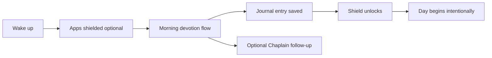

# Devotion Lock — Product Overview

## What it is

Devotion Lock is an iOS app that helps Christians start each day with intention before the noise of the phone takes over. It combines a guided morning devotion, AI spiritual companion (“Chaplain”), journaling, prayer community tools, and optional app blocking into one calm morning ritual.

Tagline from the app: **“Begin each day with intention.”**

---

## The problem it solves

Most people wake up and immediately lose the first minutes of the day to notifications, social feeds, and reactive scrolling. Spiritual habits—prayer, scripture, reflection—get pushed to “later,” and later rarely comes.

Devotion Lock addresses three related pains:

| Pain | How the app responds |
|------|----------------------|
| **Distraction wins the morning** | Optional **App Shield** uses Apple Screen Time to block selected apps until devotion is done |
| **Devotion feels vague or hard to start** | A **guided morning flow** (scripture, mood check-in, reflection prompts, voice or text journaling) removes the blank-page problem |
| **Faith feels solitary or unstructured** | **Chaplain chat**, prayer wall, prayer circles, streaks, and journey timeline give structure and continuity |

The core insight: people don’t need more content—they need a **protected window** and a **simple repeatable ritual** that fits real mornings.

---

## Who it’s for

- Christians who want a consistent morning devotion habit
- People who feel overwhelmed, restless, or scattered at the start of the day
- Users who respond to gentle accountability (streaks, shields) rather than guilt
- Small groups, families, or friends who want a private space to share prayer requests

---

## How a typical morning works

1. **Arrive** — Open the app; see today’s focus, streak, and rhythm rings on Home.
2. **Devote** — Complete the adaptive morning flow: mood, scripture, reflection, optional voice depth.
3. **Protect (optional)** — If App Shield is on, distracting apps stay covered until devotion finishes.
4. **Continue** — Journal, talk to Chaplain, pin a prayer, or check in with a circle.
5. **Return** — Streaks, widgets, and synced data reinforce the habit across days.

---

## Feature review

### Home — daily command center

- **Streak strip** and weekly completion flags
- **Daily rhythm rings**: daily verse, morning devotion, evening reflection, prayer wall
- **Personal insights** from on-device pattern analysis (themes, headline insight)
- **Shield status card** when enabled
- **Today / Earlier** timeline of journal and Chaplain conversations
- **Journey preview** and optional **week in review** (Morning Wrapped)

### Morning devotion — flagship experience

Adaptive card-based flow (`MorningFlowView`) that personalizes over time via `MorningProfile`:

- Mood and intention check-in
- Scripture from a curated catalog (with search)
- Tiered depth (standard vs. deeper reflection)
- Voice or written responses
- Completion feeds streaks, journey timeline, and optional shield unlock

This is the product’s anchor habit—the thing users come back for every day.

### Journal — Conversations tab

Unified timeline of:

- Morning devotions
- Assisted written reflections
- Voice notes
- Chaplain chat sessions (saved)

Search merges local journal entries with synced remote conversations. Entry hub supports devotion, assisted journal, and voice paths.

### Chaplain — AI spiritual companion

- **Text and voice** conversations streamed via Supabase edge function (DeepSeek-backed)
- Multiple voice personas (e.g. Grace) chosen at onboarding
- Prompt chips, guided prayers, wisdom reflections, resource library
- **Resume conversation** chip for continuity
- Clear disclosure: AI companion, not a licensed counselor

Chaplain extends the morning ritual when users want to go deeper or process something in the moment.

### Prayer wall & circles — community without noise

**Prayer wall**

- Sticky-note style pins: prayer requests, reminders, answered prayers
- Filters, celebration confetti on answered prayers, share and reflect flows

**Prayer circles**

- Private groups (family, small group, roommates)
- Posts, “praying” reactions, encouragements
- Invite codes and realtime sync when authenticated

Community features stay intimate—closer to a shared prayer room than a public social feed.

### App Shield — differentiation

Uses Apple **Family Controls / Screen Time** APIs to:

- Let users pick apps/categories to shield
- Hold shields until today’s devotion is complete (strict mode optional)
- Unlock automatically after completion

This is rare in faith apps and directly ties product value to the “lock” in Devotion Lock.

### Streaks, celebrations & widgets

- Streak tracking with born/celebration moments
- **Home screen widgets**: streak, daily verse, prayer wall snapshot
- App Group sync between app and widget extension
- Deep links into prayer wall, journal, Chaplain, streak screen

### Profile & settings

- Account (username, avatar, email, sign out, delete account)
- Reminders and notifications
- Widget onboarding
- Chaplain voice and intention mood
- Shield configuration
- Scripture passage browse
- Journal search
- Sanctuary appearance (night mode scaffolded)
- In-app Privacy Policy and Terms of Service

### Backend & sync (Supabase)

When signed in, data syncs across devices:

- Devotion sessions and streak completions
- Journey / journal entries
- Prayer wall notes
- Prayer circles (posts, memberships, encouragements)
- Chaplain conversation metadata
- Profile preferences (voice, mood, morning profile, premium flag)

Offline queues flush on launch and foreground. Account deletion is supported via edge function.

---

## Business model

**Premium subscription** with a **3-day free trial** (StoreKit introductory offer on annual plan):

| Free trial | Full subscription unlocks |
|------------|---------------------------|
| 3 days of full app access | Everything after trial ends |

After onboarding, users see the paywall. Without an active trial or subscription, the app is browsable but actions (devotion, Chaplain, journal, prayer wall, circles, shield, search, etc.) route to the paywall.

Plans: weekly and annual (`com.devotionlock.mobile.premium.weekly` / `.annual`).

---

## Design & experience principles

- **Calm sanctuary aesthetic** — soft gradients, glass cards, unhurried motion
- **Mobbin-informed patterns** — onboarding, paywall, prayer circles, journal timeline
- **Local-first resilience** — works offline; syncs when connected
- **Honest AI** — Chaplain labeled as AI; legal docs cover data and limitations
- **Privacy-aware shield** — Apple never exposes which apps are selected; only opaque tokens stored

---

## Competitive positioning

| Alternative | Devotion Lock difference |
|-------------|-------------------------|
| Generic Bible apps | Ritual + shield + journal + AI in one morning loop |
| Habit trackers | Spiritually grounded content, not just streak gamification |
| Social prayer apps | Prayer wall/circles plus private devotion and blocking |
| ChatGPT / generic AI | Chaplain tuned for devotional context, voice, saved threads, journey integration |

**One-line pitch:** *The morning app that helps you pray, reflect, and stay off your phone until you’ve actually started your day.*

---

## Current maturity (v1)

**Strengths**

- End-to-end morning devotion flow with personalization
- Real Supabase auth, sync, and AI backend
- Prayer wall + circles with offline support
- Widgets, deep links, streak system
- App Store hardening: premium gating, trial paywall, sign-out, in-app legal, export compliance checklist

**Before App Store launch (manual)**

See [LAUNCH_CHECKLIST.md](LAUNCH_CHECKLIST.md) in this folder: Family Controls entitlement, IAP in App Store Connect, public privacy URL, Supabase migrations deployed, TestFlight smoke tests.

**Deferred / v1.1 candidates**

- Sign in with Apple
- LiveKit voice AI
- Full night sanctuary theme
- Live Activities for journal sessions
- Deeper backend journal unification

---

## Summary

Devotion Lock solves the **“I never start my day with God because my phone wins first”** problem by combining **structure** (guided devotion), **support** (AI Chaplain + journal), **community** (prayer wall and circles), and **friction** (optional app shield) into a single morning ritual users can repeat and measure through streaks and sync.

It is not a church management tool, a Bible encyclopedia, or a social network—it is a **personal morning sanctuary** with just enough connection and intelligence to make showing up tomorrow easier than skipping today.
