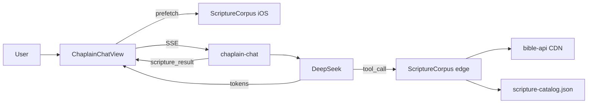

# Chaplain × Scripture Tool Calling

**Status:** Shipped (v1.2)  
**Module:** `ScriptureCorpus` — deep module, two tools

## Invariant

> Chaplain may only quote Scripture it has just looked up (tool result or client prefetch).

## Architecture



## Tools

| Tool | Input | Source |
|------|-------|--------|
| `lookup_passage` | `"John 3:16"` | KJV via wldeh/bible-api |
| `discover_passages` | `query`, optional `topics` | `SpiritualPassageCatalog` (JSON export) |

Max **2 tool rounds** per user message.

## SSE events

| Type | Payload | UI |
|------|---------|-----|
| `scripture_search` | `{ status, reference? }` | Shimmer under composer |
| `scripture_result` | `{ passages[] }` | Citation card(s) |
| `token` | `{ text }` | Stream chaplain reply |
| `done` | — | End turn |

## Client prefetch

When `BibleReferenceParser.parse(userMessage)` succeeds, iOS runs `ScriptureCorpus.lookup` before the request and sends `prefetched_scripture` in context. Edge skips redundant `lookup_passage` when text already present.

## Regenerate catalog

```bash
node scripts/export-scripture-catalog.mjs
```

Commit `supabase/functions/_shared/scripture-catalog.json` after changing `SpiritualPassageCatalog.swift`.

## Files

| Layer | Path |
|-------|------|
| iOS corpus | `DevotionLock/Services/Scripture/ScriptureCorpus.swift` |
| Context | `DevotionLock/Services/Chaplain/ChaplainContextBuilder.swift` |
| Chat UI | `DevotionLock/Components/ChaplainScriptureComponents.swift` |
| Edge corpus | `supabase/functions/_shared/scripture-corpus.ts` |
| Edge tools | `supabase/functions/chaplain-chat/tools.ts` |
| Handler | `supabase/functions/chaplain-chat/index.ts` |
